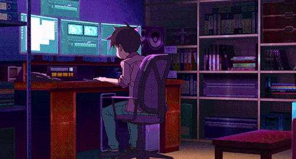

  <!-- Tema Kuning & Biru (Latar Biru, Teks Kuning) -->
  
   
  <a href="https://git.io/typing-svg">
    <!-- Tema Kuning (EAB308) dan Biru (3B82F6) -->
    
  </a>

  <a href="#-bahasa-indonesia">🇮🇩 Bahasa Indonesia</a> • 
  <a href="#-english">🇬🇧 English</a>

---

## 🇮🇩 <Bahasa Indonesia />

   
  
  
    

### 🟡 🔵 <Tentang_Kami />
**<Zekkstore Dev />** adalah agensi pengembangan perangkat lunak dan desain UI/UX independen yang telah berpengalaman dalam menghapus batasan antara desain estetis dan performa sistem yang tangguh. Kami mendedikasikan diri untuk membangun aplikasi web berskala *enterprise*, MVP untuk startup, hingga platform e-commerce yang mengutamakan kecepatan dan konversi pengguna.

Dengan pendekatan yang berorientasi pada detail (*pixel-perfect*), kami memastikan setiap antarmuka dirancang secara presisi untuk menciptakan pengalaman pengguna yang intuitif.

- 🎨 **UI/UX & Frontend Mastery**: Ahli dalam merancang ekosistem antarmuka yang modern dan responsif. Kami menerjemahkan desain indah ke dalam kode *Frontend* yang bersih, *accessible*, dan optimal secara performa menggunakan *framework* terkini.
- ⚙️ **Robust Backend Architecture**: Membangun fondasi sistem yang solid, aman, dan dapat diskalakan (*scalable*). Menguasai pengembangan backend tingkat lanjut menggunakan arsitektur **JavaScript (Node.js/Express)** dan **PHP (Laravel)** yang siap menangani trafik tinggi secara efisien.
- 💼 **Professional Collaboration**: Kami berkolaborasi secara transparan dengan klien, memberikan solusi arsitektur aplikasi yang paling relevan dengan kebutuhan bisnis Anda dari ujung ke ujung (*end-to-end*).
- 💡 **Misi**: Menyatukan inovasi struktural (*engineering excellence*) dan desain kreatif untuk mewujudkan visi digital klien menjadi produk yang berdampak.

---

## 🇬🇧 <English />

   
  
  
    

### 🟡 🔵 <About_Us />
**<Zekkstore Dev />** is an independent software development and UI/UX design agency with a proven track record of blurring the lines between aesthetic design and high-performance engineering. We are strictly dedicated to architecting enterprise-grade web applications, startup MVPs, and e-commerce platforms that prioritize speed, security, and user conversion.

Through a highly meticulous, pixel-perfect approach, we ensure that every user interaction is engineered to deliver an intuitive and memorable workflow.

- 🎨 **UI/UX & Frontend Mastery**: Experts in crafting modern, highly-responsive user interface ecosystems. We translate beautiful designs into clean, accessible, and highly-optimized frontend code using top-tier frameworks.
- ⚙️ **Robust Backend Architecture**: Building solid, secure, and infinitely scalable system foundations. We specialize in advanced backend engineering using **JavaScript (Node.js/Express)** and **PHP (Laravel)**, capable of handling high-traffic requests efficiently.
- 💼 **Professional Collaboration**: We collaborate transparently with our clients, delivering end-to-end software architecture solutions that best align with both small and large-scale business objectives.
- 💡 **Mission**: Bridging the gap between engineering excellence and creative design to transform client visions into impactful digital products.

---

### 🛠️ <Tech_Stack />

**🎨 UI/UX & Design**

  
  
  

**💻 Frontend Development**

  
  
  
  
  
  
  

**⚙️ Backend Development & Database**

  
  
  
  
  
  

**🔧 Tools & Version Control**

  
  
  
  

---

### ☕ <Support_My_Work />

Jika proyek *open-source*, template, atau portofolio ini pernah membantu Anda, jangan ragu untuk mendukung Zekkstore lewat **Trakteer**! Dukungan Anda sangat berarti bagi kami untuk terus berkarya dan membagikan *resource* bermanfaat! ❤️

   
  

---

### 🌐 <Connect_With_Me />

   
  
  
  
  
  
  
  
  

---

<!-- Kustomisasi Tema Sesuai Referensi (Pink & Cyan) -->

  
  

   
  <!-- Trophy Graph -->
  

   
  

   
  

